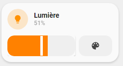

# Light with slider custom card (by schumijo)



## Installation
Download ``light_with_slider`` folder in your ``/config/lovelace/button_card_templates/community`` (where config is your home-assistant root folder).

## Usage

```yaml
- type: "custom:button-card"
  template: light_buttons
  variables:
    entity: "light.cuisine"
```